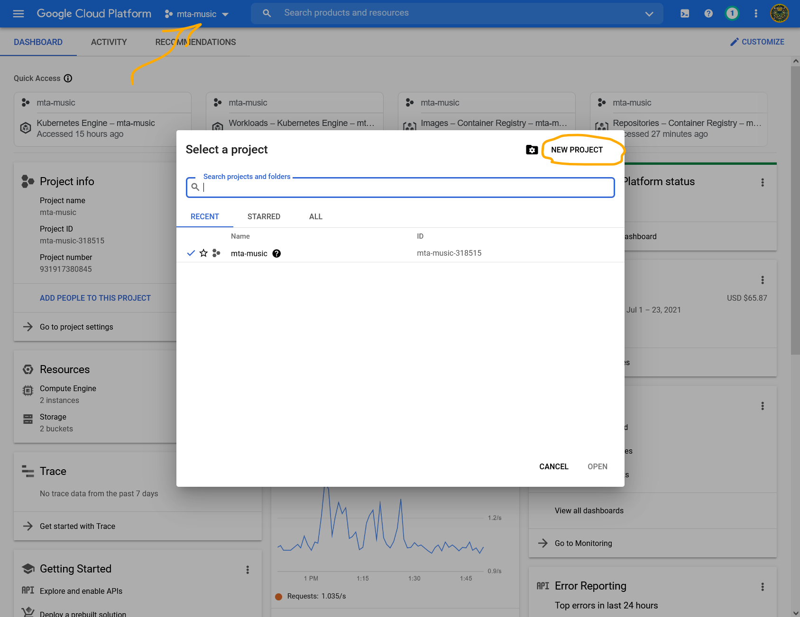
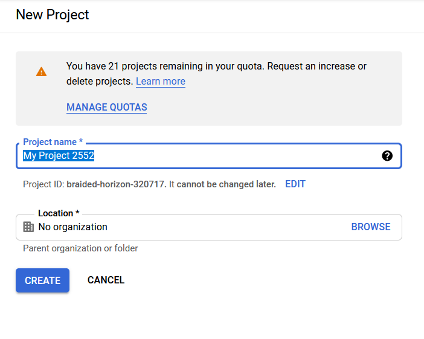
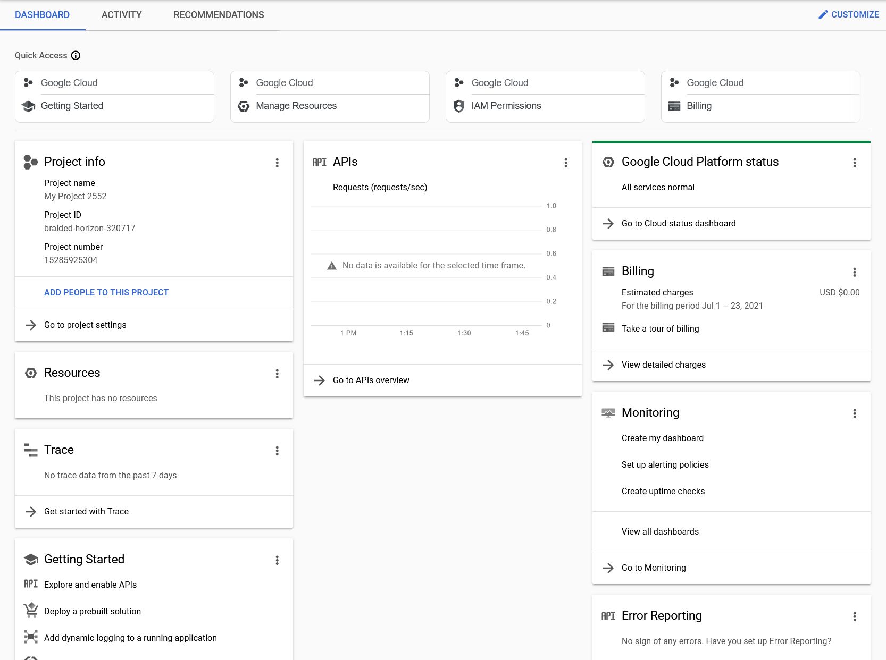
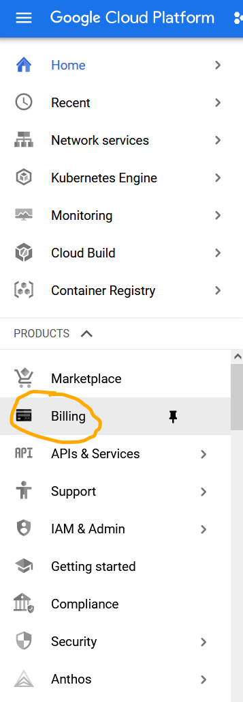
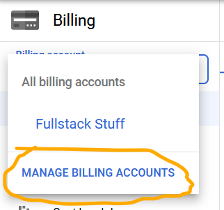
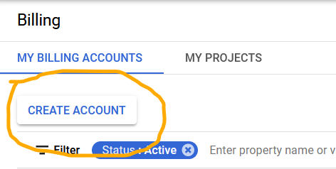
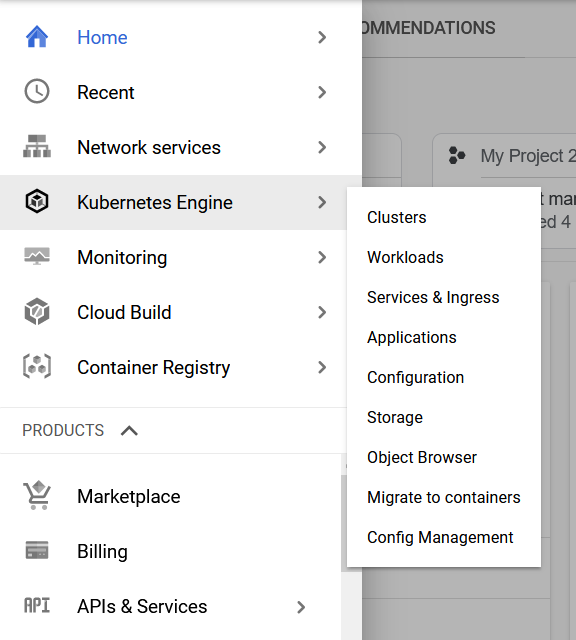
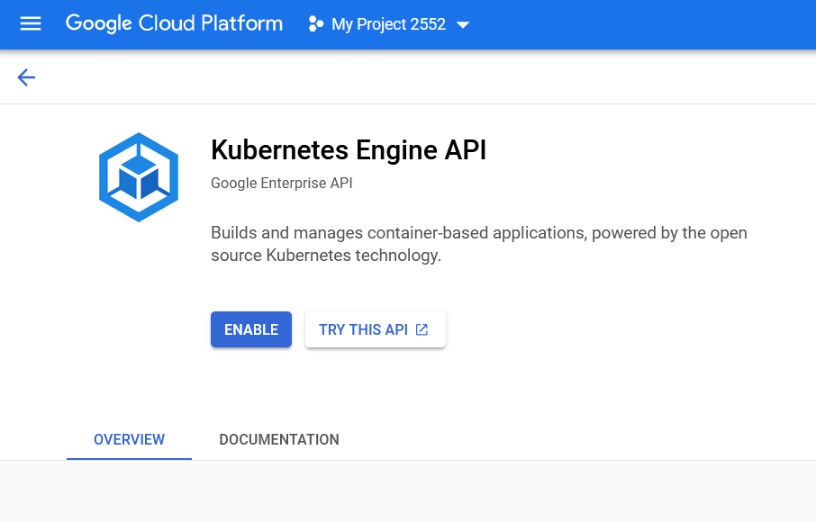

# Setting Up a GKE Cluster

In this post I explain how I set up the cluster that serves [mta-music.nyc](https://mta-music.nyc). While I could have served the site from static buckets (thanks [Gatsby](https://gatsbyjs.com)!), we have a live workload that requires the ability to wake itself up [transiter](https://transiter.io) and use a database. Also, I wanted to learn more about K8s, and setting up this cluster has certainly been a learning experience!

## Sign Up for GCP

Signing up for Google Cloud is as easy as signing into Google with your username and password, visiting the [Cloud Console](https://console.cloud.google.com), and following the prompts.

## Create a Project

The new-project flow should begin once you sign up, but just in case it doesn't, here's how you can create a new project:

1. Select the projects drop-down and select "New Project"
   
2. Enter a name for your project and select "Create"
   
3. View the new project's dashboard
   

## Set up Billing Account

Because GKE has associated costs, it's necessary to create a billing account for your project. Remember, nothing gets charged to the account until you start using services beyond those which are provided for free[^1].

1. Select "Billing" from the hamburger menu:
   
2. Select "Manage Accounts" from the account selection drop-down
   
3. In the billing view, select "Create Account"
   

[^1] The cluster we're creating will, on its own, exist in the free tier of Google's services, but the Compute instance(s) on which it runs may not be.

## Create Cluster

Now we're going to create a public cluster (meaning it's possible to connect it to the outside world, if you've got an ingress and services set up).
The first thing that needs doing is enabling the Kubernetes API:

1. Select "Kubernetes" from the hamburger menu:
   
2. Enable the Kubernetes API
   

<!--

Enable workload identity for cluster
Enable metadata server for node pool

# Setting Up Services

 ## CloudSQL Databases

In order to keep database secure from prying eyes, it will be kept private within the project's VPC.
Connections will be authorized using the Cloud SQL Auth proxy, and authenticated using IAM DB auth. While it's totally possible to add our cluster's primary subnet to the list of authorized networks, in the long-term, it's less complicated to run the proxy as a service in the cluster and let it figure out how to stay connected to the DB.

### Set up Cloud SQL Auth Proxy

In a cluster hosting multiple database loads, it's most efficient to set up the proxy as its own service.
This allows you to deploy the proxy as a service called, for example, `db`, allowing database clients to
connect to the db by using that service as their database host.

To do so, deploy gcr.io/cloudsql-docker/gce-proxy:1.17, being sure to tell the proxy to listen to all
incoming connections instead of just loopback connections:
`-instances=<CONNECTION_NAME>=tcp:0.0.0.0:<PORT>`

#### Create & Bind GCP Service Account

1. Call it `cloudsql-client-proxy`, hit `Create`
2. Assign role 'Cloud SQL Client'
3. Add policy binding to corresponding Kube Service Account

```
gcloud iam service-accounts add-iam-policy-binding \
  --role roles/iam.workloadIdentityUser \
  --member "serviceAccount:<YOUR-GCP-PROJECT>.svc.id.goog[<YOUR-K8S-NAMESPACE>/<YOUR-KSA-NAME>]" \
  <YOUR-GSA-NAME>@<YOUR-GCP-PROJECT>.iam.gserviceaccount.com
```

4. Add annotation to Kube service account

```
kubectl annotate serviceaccount \
   <YOUR-KSA-NAME> \
   iam.gke.io/gcp-service-account=<YOUR-GSA-NAME>@<YOUR-GCP-PROJECT>.iam.gserviceaccount.com
```

## TLS / HTTPS Certs

Services to be backends for load balancers should be type NodePort.

https://kosyfrances.com/ingress-gce-letsencrypt/
https://kosyfrances.com/letsencrypt-dns01/ -->
