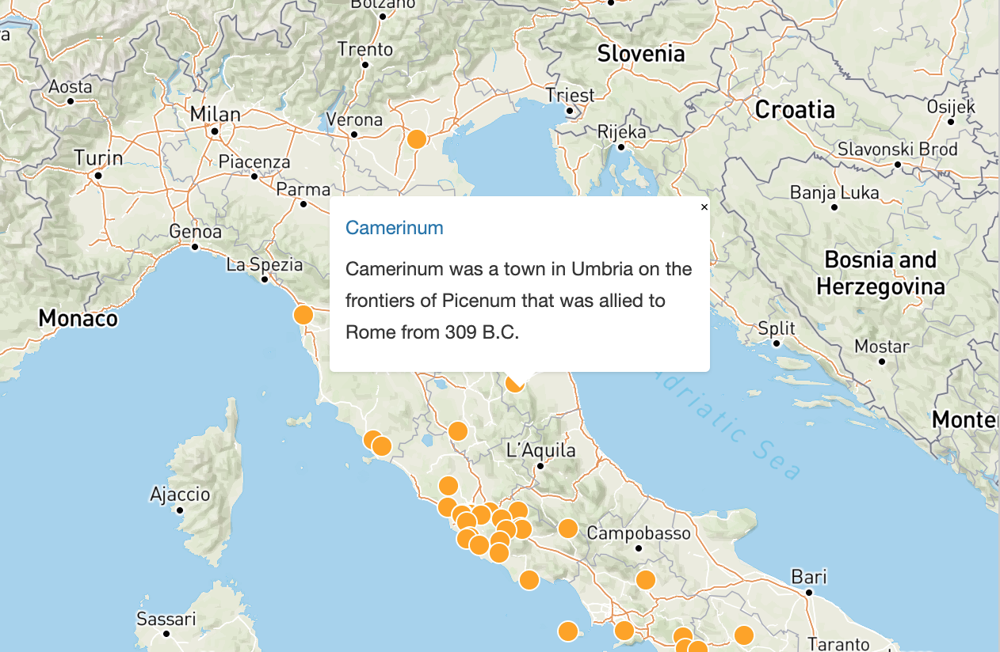
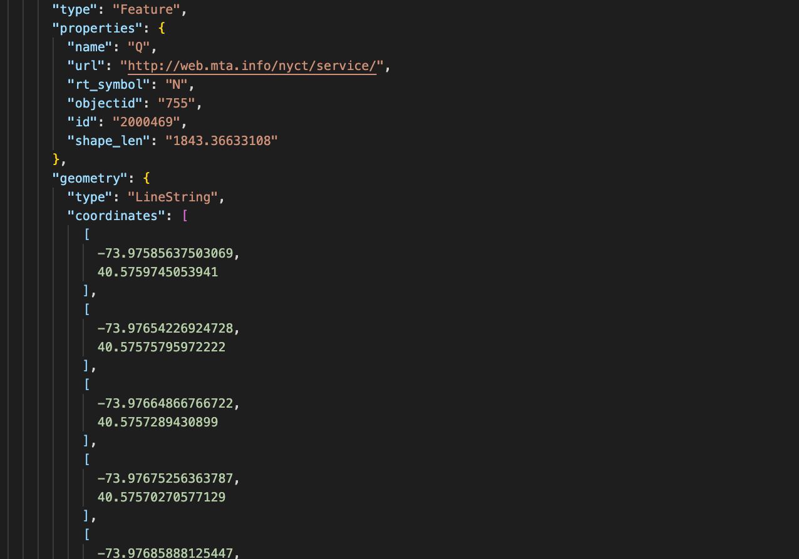
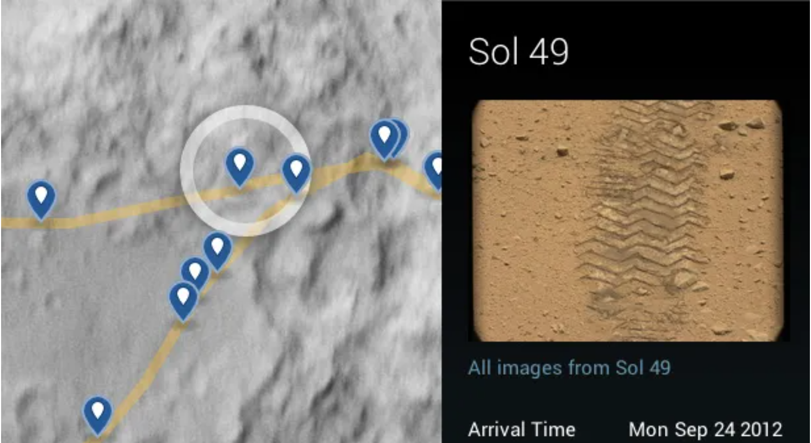

## A Brief History of geoJSON

JSON is a format familiar to full stack development, whether it is the readable file that holds a project's dependencies or sending http requests within a RESTful API. In both instances, the advantage of the JSON format is that it cuts out extraneous information and sends raw data as a string. This string looks like an object but really functions more like a list (or dict) with key/value pairs. It can be looped over or asynchronously queried, stringified or parsed. At some point in the late 2000s, as tools like MapQuest and GoogleMaps were becoming ubiquitous, a working group developed to use the JSON format for geo-spacial data. This project was codified and submitted as an RFC in 2016 as geoJSON. 

## Get some GeoJSON

Many cities provide access to data including geoJSON files for both above and underground travel. One very cool geoJSON project is Pleiades, which maps locations in the ancient world with a team of hundreds of contributors. Rides uses a geoJSON library available on NYC OpenData that holds subway station and line data. When this data is interpreted by Leaflet's library it becomes a series of points and lines that can be customized into something resembling the NYC subway system. Leaflet converts any geoJSON file to a layer, or one particular element in a file to a layer. 

The nuts and bolts of geoJSON are fairly simple, which is why many applications are able to build detailed maps that are attractive and spatially accurate with a single file. The simplest level of geoJSON map data is the point, and every point has a position that consists of the X and Y coordinates. One important thing to note is that the order of positions is longitude and latitude, the order of math and most datasets. This can lead to some issues with mapping programs or editing geoJSON yourself. A way around this in Leaflet is their built-in method: L.GeoJson.coordsToLatLngs().

## GeoJSON Structure

Once points are established, geoJSON can link two or more into a LineString, which will look something like this: 

{ "type": "LineString", "coordinates": [[-73.99487524803018, 40.6802035460625], [-73.99427469414127,, 40.68081016270495]] }

From additional strings you can build Polygon shapes, which could even have shapes nested within. The first array of coordinates will always be the “exterior ring” or outer shape, and the next arrays will be interior shapes. The interior shapes must be entirely contained and can't intersect or overlap. 

Most lines and shapes don't exist without context but are made into Features, which include a first key/value pair with a “type” and a category. Points and lines need to be nested under “geometry” and can be followed by a properties key that can include a name or description. A feature can also include a bunch of geometries grouped together, such as in the instance of creating a shape that includes a country and all of its counties. 

## Make Your Own or Map Mars

To quickly create your own map within this framework, the best move is to go to geojson.io. This mapbuilder was made by some of the employees at MapBox, which is a little like Leaflet except much flashier and no longer open-source. There have been attempts in recent years to use Mars Rover data to convert Mars into martianJSON and a project to expand geoJSON to topographical data (topoJSON). TopoJSON doesn't add a Z spatial parameter, as was attempted at some point with geoJSON, but instead creates a sequence of points (arcs) that are delta-encoded. Delta encoding is very common in video compression and uses the amount of change between points.

## A few pointers using Leaflet with GeoJSON

If you do use Leaflet, as in Rides and many other web and mobile apps, here are a few pointers. First off, there is a helpful extension in VSCode that allows you to view maps in a VSCode window straight from the geoJSON data. There are also a few ways to approach Leaflet depending on whether you are using React or doing straight DOM manipulation on your site. Without React, adding layers with geoJSON data are done directly to the “L” object and then using the method addTo(map). Rides uses React, which requires using a MapContainer to create an instance of the Map, and from there on using useMap() within various components. When you integrate a GeoJSON file into React, it will become a prop on "data". GeoJSON can also be a component itself as long as you import it from Leaflet. It will need to take key and data props in order to render the information. For more information about how to use geoJSON files with React, please see Ella's blog post "Map Your World".

### Sources

https://www.digitalocean.com/community/tutorials/how-to-work-with-json-in-javascript
https://geojson.org/
http://132.72.155.230:3838/js/javascript-basics.html#geojson
http://geojson.io
https://macwright.com/2015/03/23/geojson-second-bite.html
https://developer.here.com/blog/an-introduction-to-geojson
https://docs.mongodb.com/manual/reference/geojson/
