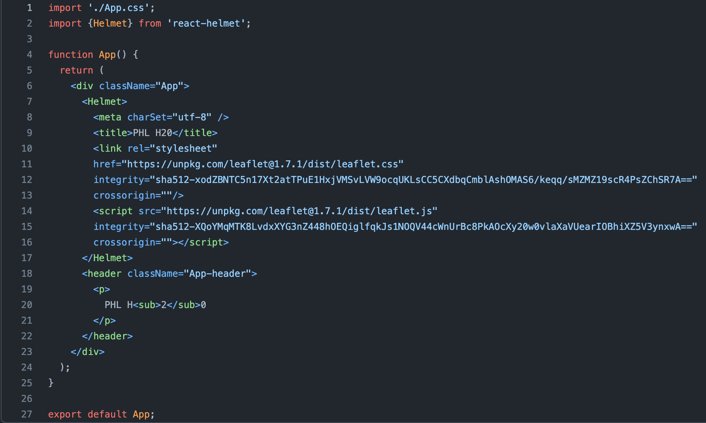

The proliferation of open source mapping technologies has made it easier than ever to plot the streams of data flowing endlessly around us. Create the geographic representations you wish to see in the world! In this article I will demonstrate how to use React and Leaflet to plot out some data on a map.

The data I’ll be mapping are particularly close to home for me. I will use a GEOJSON dataset of the regional watersheds in Philadelphia, supplied for free at the OpenDataPhilly website. For all the paywalled or otherwise subterranean data that is generated daily, there are also plenty of open data available that have probably never before been rendered visually. It’s waiting for you and your designs, dear reader, to breathe it out of its formlessness!

### Install

First, let's install our build environment and dependencies. For this project I'll use Facebook's create-react-app, which makes it exceedingly easy to do exactly what it says. We'll also use React Helmet for injecting code into the head of our HTML file, to make it easier to serve Leaflet. Run each of these lines from the browser, typing in everything after the dollar sign:

`$ npm install -g create-react-app`

`$ npx create-react-app philly-watersheds`

`$ cd philly-watersheds`

`$ npm install react-helmet`

Now follow the installation instructions in [Leaflet](https://leafletjs.com/examples/quick-start/) for installing dependencies, adding your `script` and `style` tags as children of a `Helmet` component in `App.js`, then look to [React Leaflet](https://react-leaflet.js.org/docs/start-installation) for the remaining install and setup instructions. You will want to set an ID on your `MapContainer` component, and set its height in `App.css` so that your map will render.

One slight detour: you will need to change the dependencies in your package.json once you’ve installed all the npm packages you’ll need. Change the “react-leaflet” dependency to the following string: `"react-leaflet": ">=3.1.0 <3.2.0 || ^3.2.1"`, and add the following line or replace if react-leaflet/core is already required: `"@react-leaflet/core": ">=1.0.0 <1.1.0 || ^1.1.1"`.

### Configure

You should now see a site rendering! One thing is off in this picture. We need to set the data to what we want to display, not a map of London with a default popup! I will change the ‘center’ prop being passed to MapContainer to an array of coordinates representing a rough geographical center of the map we want to display. For Philly, this will be [40.0217, -75.2013], putting our center in the Wissahickon Valley Park, Philadelphia’s largest greenspace and a historically and spiritually important water source for the Lenape, the indigenous stewards of this watershed. Let’s update the zoom prop to 11 to account for this whole local bioregion, through which the Delaware River and Schuylkill Rivers run and eventually converge. Oh, and we can remove that marker and popup– they’re all the way across the Atlantic by now.

Right now our map consists of a `MapContainer` component, with a child `TileLayer`. Let’s use the `GeoJSON` component to render the data we set out to visualize.

### Visualize

Download your GeoJSON file; I am starting by using the [Regional Watersheds](https://www.opendataphilly.org/dataset/major-watersheds-regional) dataset at OpenDataPhilly. Make a new folder in `src` called `data` or something of the sort– this will be the directory for our data files. React doesn't like parsing these objects unless they have a more familiar extension. We'll append the end of any files we're adding with a `.geojson` extension so that instead, they're ending in `.geojson.json`.

This new `Watersheds` component renders a GeoJSON layer for the data on its `data` prop. It also accepts a prop called `onEachFeature`, which takes a function with a feature and layer parameter, and runs for every new GeoJSON feature in the file it converts to a layer. In this case, we're using this function to add a popup that will open whenever a user clicks on the layer. We destructure information about the feature from its associated `.properties` object, and add that into HTML that will get rendered into a popup marker when it is called. Notice the amount of work Leaflet is doing behind the scenes here: we don't need to give it instructions to close one popup when a user opens another, or that the popup should open at the coordinates upon which the user clicks, or how to draw the GeoJSON polygon objects described in our datafile. The library handles all that work for us, so we are more free to add detail and customize our map without worrying as much about issues of lesser abstraction.

## Add layers

Our map is looking great, and is now rendering watersheds on a map... of streets. What if we want to see the relationship between nature-cultural elements of the land that can't be so easily visualized on the street grid? Let's add another tile layer to the map so that we can see a photographically accurate bird's eye view. [This page](http://leaflet-extras.github.io/leaflet-providers/preview/index.html) is a great resource for discovering some of the many Leaflet tile options available. We will also add an opacity slider to our site so that we can shift between these two views if we like.

In the header we'll add an `input` element, which will turn into a range slider when its `type` property is set as such. We will make this a controlled component which updates an `opacity` state upon user input. This state will get fed into a new `TileLayer` child of our `MapContainer`, and if we give our original tiles an inverse opacity so that they are always summing to 1, we will now have a smooth fader between map views.

## Iterate

There are so many ways directions to take with open source geography, and we've just scratched the surface of the possibilities of this mapping project. We can add more layers of GeoJSON features, and use the map to see their interrelationships. In the photo on top I've added in another GeoJSON features set of local streams, and included a [LayersControl](https://react-leaflet.js.org/docs/example-layers-control) to select which view displays on the map. You could add user customization, with the availability to save features to a list or add new details. You could even connect the map to realtime data feeds to monitor water levels or current water quality. It's my hope that this project can inspire people to pursue their own mapping projects, and that we can see the myriad ways in which we are all implicated in each other's lives through the water system flowing in and around us. If you'd like to fork this project and continue it in your own direction, feel free to clone the repo [here](https://github.com/ellatenar/PHL-H20).
